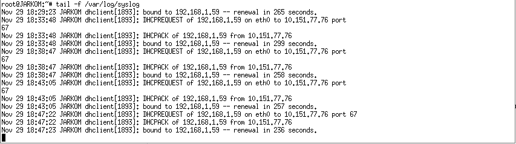

# Lapres Praktikum Jarkom Modul 3

Anri adalah seorang mahasiswa tingkat akhir yang sedang mengerjakan TA mengenai DHCP dan Proxy. Bu Meguri sebagai dosen pembimbing Anri memberikan tugas pertamanya, (1) yaitu untuk membuat topologi jaringan demi kelancaran TA-nya. Anri sudah pernah mempelajari teknik Jaringan Komputer sehingga Anri dapat membuat topologi tersebut dengan mudah. Bu Meguri memerintahkan Anri untuk menjadikan SURABAYA sebagai router, MALANG sebagai DNS Server, TUBAN sebagai DHCP server, serta MOJOKERTO sebagai Proxy server, dan UML lainnya sebagai client. Bu Meguri berpesan pada Anri untuk menyusun topologi secara hati-hati dan memperhatikan gambar topologi yang diberikan Bu Meguri.

## Soal 1

### Soal
Membuat topologi jaringan dengan SURABAYA sebagai router, MALANG sebagai DNS Server, TUBAN sebagai DHCP server, serta MOJOKERTO sebagai Proxy server, dan UML lainnya sebagai client.

### Jawaban
- Mengatur topologi dengan settingan sebagai berikut:
```
# Switch
uml_switch -unix switch1 > /dev/null < /dev/null &
uml_switch -unix switch2 > /dev/null < /dev/null &
uml_switch -unix switch3 > /dev/null < /dev/null &

# Router
xterm -T SURABAYA -e linux ubd0=SURABAYA,jarkom umid=SURABAYA eth0=tuntap,,,10.151.76.37 eth1=daemon,,,switch1 eth2=daemon,,,switch3 eth3=daemon,,,switch2 mem=256M &

# Server
xterm -T MALANG -e linux ubd0=MALANG,jarkom umid=MALANG eth0=daemon,,,switch2 mem=160M &
xterm -T MOJOKERTO -e linux ubd0=MOJOKERTO,jarkom umid=MOJOKERTO eth0=daemon,,,switch2 mem=128M &
xterm -T TUBAN -e linux ubd0=TUBAN,jarkom umid=TUBAN eth0=daemon,,,switch2 mem=128M &

# Klien
xterm -T SIDOARJO -e linux ubd0=SIDOARJO,jarkom umid=SIDOARJO eth0=daemon,,,switch1 mem=64M &
xterm -T GRESIK -e linux ubd0=GRESIK,jarkom umid=GRESIK eth0=daemon,,,switch1 mem=64M &

# Klien(2)
xterm -T BANYUWANGI -e linux ubd0=BANYUWANGI,jarkom umid=BANYUWANGI eth0=daemon,,,switch3 mem=64M &
xterm -T MADIUN -e linux ubd0=MADIUN,jarkom umid=MADIUN eth0=daemon,,,switch3 mem=64M &
```


- Membuka interface untuk masing - masing UML dengan command: **nano etc/network/interfaces**
- Mengubah interface pada **router** dengan settingan sebagai berikut:
```
auto lo
iface lo inet loopback

auto eth0
iface eth0 inet static
address <IP_eth0_SURABAYA_tiap_kelompok>
netmask 255.255.255.252
gateway <IP_tuntap_tiap_kelompok>

auto eth1
iface eth1 inet static
address 192.168.0.1
netmask 255.255.255.0

auto eth2
iface eth2 inet static
address 192.168.1.1
netmask 255.255.255.0

auto eth3
iface eth3 inet static
address <IP_eth1_SURABAYA_tiap_kelompok>
netmask 255.255.255.248
```


- Mengubah interface pada **server** dengan settingan sebagai berikut:
```
auto lo
iface lo inet loopback

auto eth0
iface eth0 inet static
address <IP_Server>
netmask 255.255.255.248
gateway <IP_eth1_SURABAYA_tiap_kelompok>
```


- Mengubah interface pada **client** dengan settingan sebagai berikut:
```
auto lo
iface lo inet loopback

auto eth0
iface eth0 inet static
```


- Restart semua router, client, dan server menggunakan command: **service networking restart**

## Soal 2

### Soal
Menggunakan SURABAYA sebagai perantara (DHCP Relay) antara DHCP Server dan client.

### Jawaban

- Install DHCP Server pada UML Tuban, dengan menggunakan command: **apt-get install isc-dhcp-server**
- Membuka konfigurasi DHCP Server dengan command: **nano etc/dhcp/dhcpd.conf**
- Mengubah konfigurasi DHCP Server dengan settingan sebagai berikut:

**Setting Untuk Subnet 1**
```
subnet 192.168.0.0 netmask 255.255.255.0 {
    option routers 192.168.0.1;
    option broadcast-address 192.168.0.255;
    max-lease-time 7200;
}

```

**Setting Untuk Subnet 2**
```
subnet <IP_DMZ> netmask 255.255.255.248 {
  range <IP_TUBAN+1> <IP_TUBAN+3>;
  option routers <IP_TUBAN>;
}

```
**Setting Untuk Subnet 3**
```
subnet 192.168.1.0 netmask 255.255.255.0 {
    option routers 192.168.1.1;
    option broadcast-address 192.168.1.255;
    max-lease-time 7200;
}

```
- Gunakan command: **nano etc/default/isc-dhcp-server** untuk mengakses default configuration dari isc-dhcp-server
- Tambahkan **eth0** pada opsi INTERFACESv4


- Restart DHCP Server dengan command: **service isc-dhcp-server restart**
- Install DHCP Relay pada SURABAYA dengan command: **apt-get install isc-dhcp-relay**
- Akan ada perintah untuk mengisikan IP Server saat proses instalasi. Masukkan **IP Tuban** saat diminta
- Pada perintah lainnya, cukup dilanjutkan dengan memilih opsi **Done**
- Ubah konfigurasi default dari isc-dhcp-relay dengan command: **nano /etc/default/isc-dhcp-relay**
- Tambahkan **eth1 eth2 eth3** pada opsi **INTERFACES**


- Restart isc-dhcp-relay dengan command: **service isc-dhcp-relay restart**
 
## Soal 3

### Soal
Client pada subnet 1 mendapatkan range IP dari 192.168.0.10 sampai 192.168.0.100 dan 192.168.0.110 sampai 192.168.0.200.

### Jawaban
Tambahkan konfigurasi berikut pada dhcpd.conf:

**Setting tambahan untuk Subnet 1**
```
range 192.168.0.10 192.168.0.100
range 192.168.0.110 192.168.0.200
```
- Restart dhcp server dengan command: **service isc-dhcp-server restart**

Testing: Lakukan pengambilan IP pada client Subnet 1 dengan perintah: **service networking restart**


## Soal 4

### Soal
Client pada subnet 3 mendapatkan range IP dari 192.168.1.50 sampai 192.168.1.70.

### Jawaban
Tambahkan konfigurasi berikut pada dhcpd.conf:

**Setting tambahan untuk Subnet 3**
```
range 192.168.1.50 192.168.1.70
```
- Restart dhcp server dengan command: **service isc-dhcp-server restart**

Testing: Lakukan pengambilan IP pada client Subnet 3 dengan perintah: **service networking restart** 


## Soal 5

### Soal
Client mendapatkan DNS Malang dan DNS 202.46.129.2 dari DHCP
### Jawaban
Tambahkan konfigurasi berikut pada dhcpd.conf:

**Setting tambahan untuk Subnet 1 dan 3**
```
option domain-name-servers <IP_MALANG>, 202.46.129.2;
```
- Restart dhcp server dengan command: **service isc-dhcp-server restart**

Testing: Lakukan pengecekan DNS pada masing - masing UML dengan command: **nano etc/resolv.conf**. Seharusnya, konfigurasi sudah menunjukkan nameserver dengan **IP Malang** dan **202.46.129.2**


## Soal 6

### Soal
Client di subnet 1 mendapatkan peminjaman alamat IP selama 5 menit, sedangkan client pada subnet 3 mendapatkan peminjaman IP selama 10 menit.

### Jawaban
Tambahkan konfigurasi berikut pada dhcpd.conf:

**Setting tambahan untuk Subnet 1**
```
default-lease-time 300;
```

**Setting tambahan untuk Subnet 3**
```
default-lease-time 600;
```
- Restart dhcp server dengan command: **service isc-dhcp-server restart**

Testing: Gunakan command: **tail -f /var/log/syslog** untuk mengecek perubahan IP untuk tiap - tiap client sesuai settingan yang telah diatur sebelumnya



## Soal 7

### Soal
Pertama, akses ke proxy **hanya bisa dilakukan** oleh Anri sendiri sebagai user TA. User autentikasi milik Anri memiliki format:
- **User** : userta_yyy
- **Password** : inipassw0rdta_yyy

### Jawaban
- Membuat file **passwd** di **MOJOKERTO** pada **/etc/squid/** dengan command:
```
htpasswd -c /etc/squid/passwd userta_c08
```

- Kemudian ubah konfigurasi pada **/etc/squid/squid.conf** menjadi berikut:

```
http_port 8080
visible_hostname mojokerto

auth_param basic program /usr/lib/squid/basic_ncsa_auth /etc/squid/passwd
auth_param basic children 5
auth_param basic realm Proxy
auth_param basic credentialsttl 2 hours
auth_param basic casesensitive on
acl USERS proxy_auth REQUIRED
```

## Soal 8

### Soal
Anri sudah menjadwal pengerjaan TA-nya setiap hari **Selasa-Rabu pukul 13.00-18.00**. Bu Meguri membatasi penggunaan internet Anri hanya pada jadwal yang telah ditentukan itu saja. Maka diluar jam tersebut, Anri tidak dapat mengakses jaringan internet dengan proxy tersebut.

### Jawaban
- Pada **/etc/squid/squid.conf** tambahkan:
```
acl "nama_variabel1" time TW 13:00-18:00

http_access allow USERS "nama_variabel1"
http_access deny all
```

## Soal 9

### Soal
Jadwal bimbingan dengan Bu Meguri adalah setiap hari **Selasa-Kamis pukul 21.00 - 09.00** keesokan harinya (sampai Jumat jam 09.00).

### Jawaban
- Pada **/etc/squid/squid.conf** tambahkan:
```
acl "nama_variabel2" time TWH 21:00-23:59
acl "nama_variabel3" time WHF 00:00-09:00

http_access allow USERS "nama_variabel2"
http_access allow USERS "nama_variabel3"
```

## Soal 10

### Soal
Agar Anri bisa fokus mengerjakan TA, setiap dia **mengakses google.com, maka akan di redirect menuju monta.if.its.ac.id** agar Anri selalu ingat untuk mengerjakan TA.

### Jawaban
- Pada **/etc/squid/squid.conf** tambahkan:
```
acl "nama_vairabel4" dstdomain www.google.com

deny_info http://monta.if.its.ac.id/ "nama_vairabel4"
http_access deny "nama_vairabel4"
```

## Soal 11

### Soal
Untuk menandakan bahwa Proxy Server ini adalah Proxy yang dibuat oleh Anri, Bu Meguri meminta Anri untuk mengubah **error page default squid.**

### Jawaban
- File **ERR_ACCESS_DENIED** pada **/usr/share/squid/errors/en/**, diganti dengan hasil download ***wget 10.151.36.202/error403.tar.gz***

## Soal 12

### Soal
Karena Bu Meguri dan Anri adalah tipe orang pelupa, maka untuk memudahkan mereka, Anri memiliki ide ketika menggunakan proxy cukup dengan mengetikkan domain **janganlupa-ta.yyy.pw** dan memasukkan port **8080**.

### Jawaban
- Di **MALANG**, pada /etc/bind/named.conf.local diisi domain **janganlupa-ta.yyy.pw** (Dalam kasus ini **janganlupa-ta.c08.pw**)


